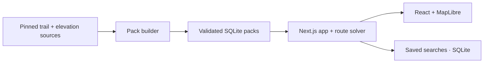

# Alpine Loop

Alpine Loop generates loop hikes from local trail data. Choose a region, draw
an area, or set a minimum and maximum drive time; then specify distance, elevation, grade, and how
much trail you are willing to repeat.

- **Quick search** finds up to the number of alternatives you request.
- **Full search** works through every eligible trailhead and saves its progress
  and results. You can cancel it and keep the routes found so far.
- **Exact and close matches stay separate.** Constraints are never relaxed
  silently, and unknown trail access is included unless you disable it.

Areas select starting points; they do not clip hikes. Routes can extend beyond
an area while staying inside installed data coverage. Results include route
geometry, elevation profiles, repetition, and mapped trail conditions.

Open a route in Results and choose **Export GPX** to download its full track
and starting point. In [CalTopo](https://training.caltopo.com/all_users/import-export/import),
choose **Import** and select the downloaded `.gpx` file. Export also works for
saved Full-search results.

## Get started

Install Git and Docker with Docker Compose, and make sure Docker is running. I personally use orbStack.
On Windows, use a WSL terminal with Docker integration enabled.

```sh
git clone https://github.com/heddayam/alpine-loop.git
cd alpine-loop
./alpine.sh
```

The interactive selector shows estimated download and finished pack sizes, or
the actual pack size for installed regions. Finished sizes exclude source caches. Use
↑/↓ to move and Enter to toggle a region, then choose **Apply changes**.
Installed packs start checked. Checked rows are green; pending installs and
removals are labeled as you change the selection.
Washington choices include **North Cascades**, **Central Cascades**,
**Rainier–Goat Rocks**, **Southwest Cascades**, and **Olympic Peninsula**.
Olympic includes mapped beach trails such as the Ozette loop; check tides and
current conditions yourself because route generation does not time beach
passability.

The script creates `.env` if needed and builds selected packs inside Docker;
you do not need Node, Python, or geographic tools on your computer. The first
build downloads substantial source data and can take a while. Progress is
shown with download counters and compiler substeps, and completed downloads are
cached for reuse if you interrupt and retry.

The current Central Cascades builder has completed a full build with Docker
limited to 4 GiB RAM and swap disabled. See the
[pack-build measurements](docs/rebuild/pack-build-audit.md#implementation-results)
for the tested data and limits.

Once preparation finishes, start the app:

```sh
docker compose up --build
```

Open [localhost:3000](http://localhost:3000). Stop with Ctrl+C; start again with
`docker compose up`. Use `--build` after updating the application code.

### Manage your data

Stop the app and rerun `./alpine.sh` to add or remove regions. Removals require
confirmation and are blocked while unfinished saved searches depend on the
pack. Completed saved routes are retained. Source caches remain available for
future builds.

| Data | Location |
| --- | --- |
| Installed regional packs | `.local-data/packs/` |
| Download and build caches | `.cache/` |
| Docker saved searches and settings | `alpine-runtime` Docker volume |

These survive app restarts and rebuilds and stay out of Git. `docker compose
down` also preserves them; `docker compose down -v` deletes Docker's saved
runtime data.

### Optional settings

Named regions and drawn areas work without API keys. For place suggestions and
drive-time filters, add an ArcGIS key with temporary geocoding and routing
service-area access to `.env`:

```dotenv
ARCGIS_API_KEY=your-key
```

Separate scoped keys are also supported; see [.env.example](.env.example).
Keys stay on the server. Apply changes with
`docker compose up --force-recreate` or restart the local development server.
Trail and elevation data are local; map tiles, place suggestions, and drive-time
filters use online services.

The app binds to localhost by default. Set `ALPINE_PORT=8080` in `.env` to change
the port, or `ALPINE_BIND_ADDRESS=0.0.0.0` to allow access from your local network.

## Develop

Install packs with `./alpine.sh`, stop the Docker app, then use Node.js 24:

```sh
npm ci
npm run dev
```

Open [localhost:3000](http://localhost:3000). Changes reload automatically. Local
development reads the same packs and stores its own saved searches and settings
in `.local-data/runtime/`. Set `ALPINE_PACK_ROOT` to use a different pack folder.

```sh
npm run verify                  # Lint, types, unit tests, production build
npx playwright install chromium # First browser-test setup
npm run test:browser             # Browser flows using committed fixtures
```

Automated tests do not fetch trail data or call external providers.

### How it fits together



The builder prepares and validates regional data before activating a pack.
The app reads packs without modifying them. A bounded pool of local processes
runs Quick searches across packs and Full searches across trailheads, including
within one pack, while keeping the interface and cancellation responsive.
Quick search within a single pack retains its existing search budget.
`ALPINE_SOLVER_WORKERS` accepts 1–8 and defaults to at most two available CPUs
per search; additional workers use more memory. Set it in `.env` for native or
Docker use. Saved Full searches remain FIFO, with ordered progress checkpoints.

- `app/` and `components/` — API routes and map workspace.
- `lib/solver/` and `lib/graph/` — route generation and graph reads.
- `lib/data/` and `data/regions/` — pack compilation and regional definitions.
- `lib/route-jobs/` — saved search execution and persistence.

<details>
<summary>Build packs directly without Docker</summary>

With Node dependencies installed, install `osmium-tool` and
[uv](https://docs.astral.sh/uv/), then prepare the locked Python environment:

```sh
uv sync --frozen --project tools/dem --python 3.12
npm run pack:bootstrap -- --pack=central-cascades --progress
```

Builds reuse verified local sources and download missing inputs. Add `--offline`
to prohibit source acquisition, or `--refresh` to explicitly rediscover pinned
sources. An unchanged pack is revalidated and reused before graph preparation.
The source cache works across Docker and native builds; moving the checkout does
not require downloading the sources again. The default output is `.local-data/packs/`.
For data audits, representative route checks,
and adding a region, follow the [regional checklist](docs/rebuild/region-onboarding-checklist.md).

</details>

## Further reading

- [System design](docs/rebuild/system-design.md) and [product behavior](docs/rebuild/implementation-plan.md)
- [Route engine](docs/rebuild/closed-route-topology-plan.md)
- [Data sources and licensing](docs/rebuild/data-sources.md)
- [Regional roadmap](docs/rebuild/regional-expansion-plan.md) and [new region checklist](docs/rebuild/region-onboarding-checklist.md)
- [Project status](docs/rebuild/status.md)
