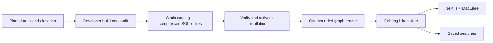

# Alpine Loop

Alpine Loop generates loop hikes from local trail data. Choose a region, draw
an area, or set a minimum and maximum drive time; then specify distance, elevation, grade, and how
much trail you are willing to repeat.

- **Full search** works through every eligible trailhead and saves its progress
  and results. You can cancel it and keep the routes found so far.
- **Exact and close matches stay separate.** Constraints are never relaxed
  silently, and unknown trail access is included unless you disable it.

Areas select starting points; they do not clip hikes. Routes can extend beyond
an area while staying inside installed data coverage. Results include route
geometry, elevation profiles, repetition, and mapped trail conditions.

Open a route in Results and choose **Export GPX** to download its full track
and starting point. In [CalTopo](https://training.caltopo.com/all_users/import-export/import),
choose **Import** and select the downloaded `.gpx` file. Export also works for
saved Full-search results.

## Get started

Install Git and Docker with Docker Compose, and make sure Docker is running. I personally use orbStack.
On Windows, use a WSL terminal with Docker integration enabled.

```sh
git clone https://github.com/heddayam/alpine-loop.git
cd alpine-loop
./alpine.sh
```

Open [localhost:3000](http://localhost:3000). In **Coverage**, beside Settings,
select map sections, review their download and disk sizes, and download them.
You can pause or resume downloads and keep searching the current installation.
The whole selection activates after verification. Named hiking regions remain
search filters; they are separate from download sections.

Set `ALPINE_COVERAGE_CATALOG` to a maintained HTTPS `release.json` URL, or use a
local developer release. Docker defaults to `.local-data/releases/prepared`.
A public catalog is not bundled with the repository. Without a configured
release, Coverage explains that data is unavailable.

The app downloads prepared SQLite data. It does not run Python, GDAL, osmium,
or source compilation. Mapped beach trails are supported; tide timing is not
modeled.

### Manage your data

Use Coverage to add, update, or remove sections. Updates replace all selected
coverage with one compatible release. Verified downloads survive interruption;
running and saved searches retain their referenced installation. Previously
built regional packs require a one-time reinstall. Saved route geometry,
metadata, and GPX exports remain readable; legacy files are preserved until
replacement coverage has been verified.

| Data | Location |
| --- | --- |
| Native installed artifacts and download jobs | `.local-data/coverage/` |
| Developer release output | `.local-data/releases/prepared/` |
| Developer sources and staging | `.cache/` or configured build root |
| Docker coverage, searches, and settings | `alpine-runtime` Docker volume |

`docker compose down` preserves runtime data; `docker compose down -v` deletes
that volume. Restart with `./alpine.sh` or `docker compose up -d app`.

### Optional settings

Named regions and drawn areas work without API keys. For place suggestions and
drive-time filters, add an ArcGIS key with temporary geocoding and routing
service-area access to `.env`:

```dotenv
ARCGIS_API_KEY=your-key
```

Separate scoped keys are also supported; see [.env.example](.env.example).
Keys stay on the server. Apply changes with
`docker compose up --force-recreate` or restart the local development server.
Trail and elevation data are local; map tiles, place suggestions, and drive-time
filters use online services.

The app binds to localhost by default. Set `ALPINE_PORT=8080` in `.env` to change
the port, or `ALPINE_BIND_ADDRESS=0.0.0.0` to allow local-network access.

## Develop

Use Node.js 24:

```sh
npm ci
npm run dev
```

Open [localhost:3000](http://localhost:3000). Changes reload automatically. Local
development stores saved searches and settings in `.local-data/runtime/`.
Set `ALPINE_COVERAGE_CATALOG` to the release directory used by your build.

```sh
npm run verify                  # Lint, types, unit tests, production build
npx playwright install chromium # First browser-test setup
npm run test:browser             # Browser flows using committed fixtures
```

Automated tests do not fetch trail data or call external providers.

### Developer data builds

One CLI handles `build`, `inspect`, and `export`. Recipes specify intended
coverage, pinned sources, exclusions, and resource settings. Interrupted builds
resume verified staging and metric caches. Reuse one `ALPINE_SOURCE_CACHE` across
recipes; developer inventories and staging can occupy tens of GB. Retire
superseded validation outputs after recording their audits. A release is exported only after the
complete graph and source inventory pass audit.

```sh
npm run data -- build data/coverage/recipes/cascades.json
npm run data -- inspect .local-data/releases/prepared/release.json
npm run data -- export /absolute/path/export-options.json
```

Native builds need `osmium-tool`, `uv`, and the locked DEM environment:

```sh
uv sync --frozen --project tools/dem --python 3.12
```

Example recipes cover the Cascades and Olympic Peninsula. To use the separate
Docker tooling:

```sh
docker compose run --rm data scripts/data.ts build data/coverage/recipes/cascades.json
```

The separate Docker `data` service includes these tools and applies a 4 GiB
memory limit with swap disabled. The ordinary `app` image excludes them.
See [prepared coverage](docs/rebuild/prepared-coverage.md) for contracts,
configuration, and acceptance evidence. Large-region feasibility remains
unproven until the measured build gate passes.

### How it fits together



There is no merged local routing database. Files share release-wide source
identities, and routes can cross installed section boundaries. Full search
uses one coherent graph and distributes starts among bounded workers.
`ALPINE_SOLVER_WORKERS` accepts 1–8 and defaults to at most two available CPUs.
Saved Full searches remain FIFO with ordered checkpoints.

- `app/` and `components/` — API routes and map workspace.
- `lib/solver/` and `lib/graph/` — route generation and bounded graph reads.
- `lib/data/` and `lib/coverage/` — developer compilation and audits.
- `lib/coverage-install/` — prepared downloads, installations, and retention.
- `lib/route-jobs/` — saved search execution and persistence.

## Further reading

- [System design](docs/rebuild/system-design.md) and [product behavior](docs/rebuild/implementation-plan.md)
- [Route engine](docs/rebuild/closed-route-topology-plan.md)
- [Data sources and licensing](docs/rebuild/data-sources.md)
- [Regional roadmap](docs/rebuild/regional-expansion-plan.md) and [new region checklist](docs/rebuild/region-onboarding-checklist.md)
- [Project status](docs/rebuild/status.md)
