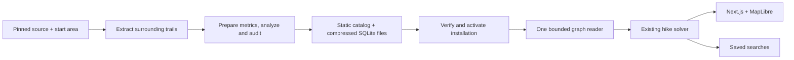

# Alpine Loop

Alpine Loop generates loop hikes from local trail data. Choose a region, draw
an area, or set a minimum and maximum drive time; then specify distance, elevation, grade, and how
much trail you are willing to repeat.

- **Full search** works through every eligible trailhead and saves its progress
  and results. You can cancel it and keep the routes found so far.
- **Exact and close matches stay separate.** Constraints are never relaxed
  silently, and unknown trail access is included unless you disable it.

Areas select starting points; they do not clip hikes. Routes can extend beyond
an area while staying inside installed data coverage. Results include route
geometry, elevation profiles, repetition, and mapped trail conditions.

Open a route in Results and choose **Export GPX** to download its full track
and starting point. In [CalTopo](https://training.caltopo.com/all_users/import-export/import),
choose **Import** and select the downloaded `.gpx` file. Export also works for
saved Full-search results.

## Get started

Install Git and Docker with Docker Compose, and make sure Docker is running. I personally use orbStack.
On Windows, use a WSL terminal with Docker integration enabled.

```sh
git clone https://github.com/heddayam/alpine-loop.git
cd alpine-loop
./alpine.sh
```

Open [localhost:3000](http://localhost:3000). In **Coverage**, beside Settings,
select map sections, review their download and disk sizes, and download them.
You can pause or resume downloads and keep searching the current installation.
The whole selection activates after verification. Named hiking regions remain
search filters; they are separate from download sections.

Set `ALPINE_COVERAGE_CATALOG` to a maintained HTTPS `release.json` URL, or use a
local developer release. Docker defaults to `.local-data/releases/prepared`.
A public catalog is not bundled with the repository. Without a configured
release, Coverage explains that data is unavailable.

The app downloads prepared SQLite data. It does not run Python, GDAL, osmium,
or source compilation. Mapped beach trails are supported; tide timing is not
modeled.

### Manage your data

Use Coverage to add, update, or remove sections. Updates replace all selected
coverage with one compatible release. Verified downloads survive interruption;
running and saved searches retain their referenced installation. Previously
built regional packs require a one-time reinstall. Saved route geometry,
metadata, and GPX exports remain readable; legacy files are preserved until
replacement coverage has been verified.

| Data | Location |
| --- | --- |
| Native installed artifacts and download jobs | `.local-data/coverage/` |
| Developer release output | `.local-data/releases/prepared/` |
| Developer sources and staging | `.cache/` or configured build root |
| Docker coverage, searches, and settings | `alpine-runtime` Docker volume |

`docker compose down` preserves runtime data; `docker compose down -v` deletes
that volume. Restart with `./alpine.sh` or `docker compose up -d app`.

### Optional settings

Named regions and drawn areas work without API keys. For place suggestions and
drive-time filters, add an ArcGIS key with temporary geocoding and routing
service-area access to `.env`:

```dotenv
ARCGIS_API_KEY=your-key
```

Separate scoped keys are also supported; see [.env.example](.env.example).
Keys stay on the server. Apply changes with
`docker compose up --force-recreate` or restart the local development server.
Trail and elevation data are local; map tiles, place suggestions, and drive-time
filters use online services.

The app binds to localhost by default. Set `ALPINE_PORT=8080` in `.env` to change
the port, or `ALPINE_BIND_ADDRESS=0.0.0.0` to allow local-network access.

## Develop

Use Node.js 24:

```sh
npm ci
npm run dev
```

Open [localhost:3000](http://localhost:3000). Changes reload automatically. Local
development stores saved searches and settings in `.local-data/runtime/`.
Set `ALPINE_COVERAGE_CATALOG` to the release directory used by your build.

```sh
npm run verify                  # Lint, types, unit tests, production build
npx playwright install chromium # First browser-test setup
npm run test:browser             # Browser flows using committed fixtures
```

Automated tests do not fetch trail data or call external providers.

### Developer data builds

The workflow is **choose a start area → preview its buffered extent → build**.
A source recipe pins provider data and reviewed exclusions. The bounding box
selects eligible starting points; routes can leave that box. Preparation includes
surrounding trails for requests up to **40 miles**, with a **25-mile buffer** to
preserve the solver's explicitly labeled close matches up to 50 miles.

The commands below use a small start area near Index, Washington as an example.
Change `START_BBOX` to your desired west,south,east,north coordinates. It selects
all eligible starts there, not a named hike or connected network.

```sh
# Build tooling only; this does not build trail data.
docker compose build data
START_BBOX='-121.6,47.75,-121.5,47.85'

# Immediate geometry preview: no downloads, normalization or graph work.
docker compose run --rm data scripts/data.ts plan \
  data/coverage/recipes/washington.json --bbox "$START_BBOX"

# Prepare that area and its surrounding trails, reusing this checkout's cache.
docker compose run --rm \
  -e ALPINE_SOURCE_CACHE=/app/.cache/progressive-feasibility/shared-sources \
  data scripts/data.ts build data/coverage/recipes/washington.json --bbox "$START_BBOX"

# In another terminal:
npm run data -- status --watch
```

`plan` prints the start and routing geometries; download size is known only after
compilation. Missing provider coverage anywhere in the required buffer fails
before data processing: add an adjacent pinned source or choose an interior area.
Reviewed exclusions remain hard route boundaries.

The builder verifies the compressed source and extracts a bounded subset with
complete way references before normalization. It then prepares local metrics,
topology, access evidence and elevation. It does not inventory statewide trail
connectivity. Osmium still scans the provider file, and elevation can require
large raster downloads. Local preparation is not a fixed time or disk guarantee.

Building another box adds or replaces its area in the published local catalog.
Unchanged areas reuse their artifacts; overlapping builds reuse measured segment
metrics, but keep independent topology and may duplicate stored trails. A source
pin conflict with retained areas fails instead of silently mixing snapshots.

A fresh clone can omit the source-cache override. Ctrl+C stops at a checkpoint;
repeat the command to reuse verified completed work. Incomplete source imports
restart their local normalization. Transient extracts and staging files are
removed on completion or cancellation; pinned downloads and metric caches remain.
Reports live at `${ALPINE_COVERAGE_ROOT:-.cache/build}/status.json`.
`status [report.json] --watch` refreshes every five seconds; stale reports are not
live heartbeats.

For native tooling, install `osmium-tool` and `uv`, then run
`uv sync --frozen --project tools/dem --python 3.12`. Use
`npm run data -- plan data/coverage/recipes/washington.json --bbox "$START_BBOX"`
and replace `plan` with `build` to prepare data. Set `ALPINE_SOURCE_CACHE` to the
matching host cache path. `npm run data -- inspect
.local-data/releases/prepared/release.json` audits a published release.
The former `discover`, `networks`, and `--network` workflow is removed.

After publication, refresh the app, open **Coverage**, select an area, review
its size and click **Download**. Selected areas define eligible starts; their
surrounding trails are included automatically. Building or restarting the app
image alone does not prepare or install trail data. Saved results and settings
remain separate from coverage.

The Docker `data` service applies a 4 GiB memory limit with swap disabled; the
ordinary `app` image excludes data tools. See [prepared coverage](docs/rebuild/prepared-coverage.md)
for contracts and acceptance evidence. Real-source preparation time, disk and
memory remain unmeasured for this replacement.

### How it fits together


```mermaid
flowchart LR
    Sources["Pinned source + start area"] --> Extract["Extract surrounding trails"]
    Extract --> Builder["Prepare metrics, analyze and audit"]
    Builder --> Release["Static catalog + compressed SQLite files"]
    Release --> Download["Verify and activate installation"]
    Download --> Reader["One bounded graph reader"]
    Reader --> Solver["Existing hike solver"]
    Solver --> Map["Next.js + MapLibre"]
    Solver --> Jobs["Saved searches"]
```

There is no merged local routing database. Each start uses one complete local graph,
including its surrounding buffer. Overlapping prepared graphs are never stitched
together. Full search distributes eligible starts among bounded workers.
`ALPINE_SOLVER_WORKERS` accepts 1–8 and defaults to at most two available CPUs.
Saved Full searches remain FIFO with ordered checkpoints.

- `app/` and `components/` — API routes and map workspace.
- `lib/solver/` and `lib/graph/` — route generation and bounded graph reads.
- `lib/data/` and `lib/coverage/` — developer compilation and audits.
- `lib/coverage-install/` — prepared downloads, installations, and retention.
- `lib/route-jobs/` — saved search execution and persistence.

## Further reading

- [System design](docs/rebuild/system-design.md) and [product behavior](docs/rebuild/implementation-plan.md)
- [Route engine](docs/rebuild/closed-route-topology-plan.md)
- [Data sources and licensing](docs/rebuild/data-sources.md)
- [Regional roadmap](docs/rebuild/regional-expansion-plan.md) and [new region checklist](docs/rebuild/region-onboarding-checklist.md)
- [Project status](docs/rebuild/status.md)
