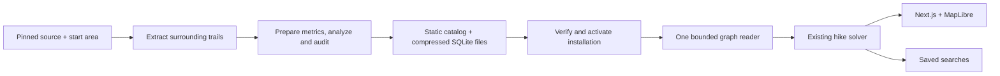

# Alpine Loop

Alpine Loop generates loop hikes from local trail data. Choose a region, draw
an area, or set a minimum and maximum drive time; then specify distance, elevation, grade, and how
much trail you are willing to repeat.

- **Full search** works through every eligible trailhead and saves its progress
  and results. You can cancel it and keep the routes found so far.
- **Exact and close matches stay separate.** Constraints are never relaxed
  silently, and unknown trail access is included unless you disable it.

Areas select starting points; they do not clip hikes. Routes can extend beyond
an area while staying inside installed data coverage. Results include route
geometry, elevation profiles, repetition, and mapped trail conditions.

Open a route in Results and choose **Export GPX** to download its full track
and starting point. In [CalTopo](https://training.caltopo.com/all_users/import-export/import),
choose **Import** and select the downloaded `.gpx` file. Export also works for
saved Full-search results.

## Get started

Install Git and Docker with Docker Compose, and make sure Docker is running. I personally use orbStack.
On Windows, use a WSL terminal with Docker integration enabled.

```sh
git clone https://github.com/heddayam/alpine-loop.git
cd alpine-loop
./alpine.sh
```

Open [localhost:3000](http://localhost:3000). In **Coverage**, beside Settings,
choose named hiking areas, review their download and active-data sizes, and download them.
You can pause or resume downloads and keep searching the current installation.
The download activates after verification. Downloaded areas become available in
Plan, where they filter starting points. Their surrounding trail data lets hikes
continue beyond the selected area.

Set `ALPINE_COVERAGE_CATALOG` to a maintained HTTPS `release.json` URL, or use a
local developer release. Docker defaults to `.local-data/releases/prepared`.
A public catalog is not bundled with the repository. Without a configured
release, Coverage explains that data is unavailable.

The app downloads prepared SQLite data. It does not run Python, GDAL, osmium,
or source compilation. Mapped beach trails are supported; tide timing is not
modeled.

### Manage your data

Use Coverage to add, update, or remove areas. Each area shows **Available**,
**Downloaded**, or **Update available**. Selecting a new area adds it to your
existing coverage; removing an area is a separate action. Updates reuse unchanged
files and activate one compatible installation. Verified downloads survive
interruption; running and saved searches retain their referenced installation.
Active trail-data sizes exclude older files retained for those searches.

| Data | Location |
| --- | --- |
| Native installed artifacts and download jobs | `.local-data/coverage/` |
| Developer release output | `.local-data/releases/prepared/` |
| Developer sources and staging | `.cache/` or configured build root |
| Docker coverage, searches, and settings | `alpine-runtime` Docker volume |

`docker compose down` preserves runtime data; `docker compose down -v` deletes
that volume. Restart with `./alpine.sh` or `docker compose up -d app`.

### Optional settings

Named regions and drawn areas work without API keys. For place suggestions and
drive-time filters, add an ArcGIS key with temporary geocoding and routing
service-area access to `.env`:

```dotenv
ARCGIS_API_KEY=your-key
```

Separate scoped keys are also supported; see [.env.example](.env.example).
Keys stay on the server. Apply changes with
`docker compose up --force-recreate` or restart the local development server.
Trail and elevation data are local; map tiles, place suggestions, and drive-time
filters use online services.

The app binds to localhost by default. Set `ALPINE_PORT=8080` in `.env` to change
the port, or `ALPINE_BIND_ADDRESS=0.0.0.0` to allow local-network access.

## Develop

Use Node.js 24:

```sh
npm ci
npm run dev
```

Open [localhost:3000](http://localhost:3000). Changes reload automatically. Local
development stores saved searches and settings in `.local-data/runtime/`.
Set `ALPINE_COVERAGE_CATALOG` to the release directory used by your build.

```sh
npm run verify                  # Lint, types, unit tests, production build
npx playwright install chromium # First browser-test setup
npm run test:browser             # Browser flows using committed fixtures
```

Automated tests do not fetch trail data or call external providers.

### Developer data builds

The workflow is **choose named hiking areas → preview → build**. Run `data regions`
for the configured names: twelve Washington groups and the four existing California
areas. Washington's 39 counties are all assigned; names organize downloads, while
access and **fewer than 10 mapped buildings within 500 metres** determine eligible
starts. Quiet foothill and lowland starts qualify too. California retains its exact
previous footprints. See the [territory definitions](data/coverage/territories/README.md)
for grouping and boundary limitations.

Central Cascades preserves the Glacier Peak and Henry M. Jackson pilot footprints
and approaches. Areas become downloadable after a successful build, then install
through Coverage. Larger start territories increase source-processing costs; build
times and artifact sizes need measurement. The ten-minute target is not established
for these expanded areas. Forest aliases do not promise entire-forest coverage.

```sh
# Build tooling only; this does not process trail data.
docker compose build data
docker compose run --rm data scripts/data.ts regions

# Preview several areas without downloads or source processing.
docker compose run --rm data scripts/data.ts plan santa-cruz-mountains henry-coe

# California reuses the retained default .cache/sources cache.
# Explicit selections run one at a time.
docker compose run --rm data scripts/data.ts build \
  santa-cruz-mountains southern-east-bay monterey-carmel henry-coe

# Rebuild the expanded existing Washington groups:
docker compose run --rm \
  -e ALPINE_SOURCE_CACHE=/app/.cache/progressive-feasibility/shared-sources \
  data scripts/data.ts build central-cascades north-cascades rainier-goat-rocks southwest-cascades olympic-peninsula

# Additional Washington groups, also built sequentially:
docker compose run --rm \
  -e ALPINE_SOURCE_CACHE=/app/.cache/progressive-feasibility/shared-sources \
  data scripts/data.ts build north-puget south-puget willapa-hills \
  northeast-washington spokane-palouse columbia-basin blue-mountains

# In another terminal:
npm run data -- status --watch
```

All requested names and route-buffer source coverage are validated before any
build starts. Duplicate names are rejected. A failure or pause stops the sequence;
areas already published remain available. Repeat the command to reuse completed
artifacts and cached inputs. Each area publishes separately; this is not an atomic
batch release. The status report describes the current/last area, and the command
prints a completion summary for each. Planning several areas prints one JSON
object per area.

Adding an area preserves neighboring published artifacts. In Coverage, select the
new areas, review their sizes, and choose **Download**; several selections share
one download job. Existing installed areas remain installed. Overlapping areas
search each shared start through one owning graph.

`plan` prints eligible start geometry and the surrounding routing extent. Requests
remain capped at **40 miles**; the conservative **25-mile buffer** also supports
explicitly labeled close matches up to 50 miles. Missing US source coverage fails
before processing. The declared international border and reviewed exclusions are
hard routing limits. Download bytes become known after preparation.

The builder extracts local trails and access/building context, finds sparse eligible
starts, then prunes trails that cannot participate within their distance budget
**before elevation work**. It requests only DEM tiles owning retained samples. It reuses segment metrics across overlapping
builds, then stores compact corridors with their full geometry and elevation profiles.
Each named region remains an independent graph; overlapping regions never get stitched
together. Pinned region inputs live in `data/coverage/regions/catalog.json`.
Before publication, each reviewed approach must have a mapped starting point in
the final graph within its declared registration neighborhood, or an actual mapped
start explicitly excluded by the building rule and named in release limitations.
Missing topology still stops publication and names the approach to investigate; the
previous release remains usable. Areas with no eligible starts stop before elevation.
This check does not establish a complete approach/trail inventory
or guarantee a suitable loop from every start.

Unchanged builds validate dependencies and reuse their artifact before normalization.
Building another named region adds it; rebuilding the same ID replaces it. The first
named publication retires anonymous bbox entries from the active catalog, retaining
immutable files needed by saved references. Conflicting source pins in retained
regions fail explicitly; source refresh is a coherent generation change, not a
partial mixed-snapshot update.

Osmium still scans the provider extract, and missing DEM tiles can be large. About
ten minutes for a first useful region is the **acceptance target, not a measured
guarantee**. Status records stage timings, work counts and measured memory/disk peaks;
first-download time and warm reuse should be evaluated separately.

Use the default `.cache/sources` for the retained California source/DEM cache and
the shown shared-source override for this checkout's Washington/Oregon cache.
A fresh clone can omit the source-cache override. Ctrl+C stops at a checkpoint;
repeat the command to reuse verified work. Incomplete imports restart normalization.
Temporary build files and child processes are cleaned up; useful source/DEM/metric
caches remain. Reports live at `${ALPINE_COVERAGE_ROOT:-.cache/build}/status.json`.
`status --watch` refreshes every five seconds; it watches the report, not the process.

For native tooling, install `osmium-tool` and `uv`, run
`uv sync --frozen --project tools/dem --python 3.12`, then use
`npm run data -- plan central-cascades` or `npm run data -- build central-cascades`.
`npm run data -- inspect .local-data/releases/prepared/release.json` performs a full
transport and graph audit. The bbox, discovery and network-ID commands are removed.

After publication, rebuild/start the app with
`docker compose up --detach --build app`. Open **Coverage**, select the
areas you built, review their sizes and select **Download**. The page remains the normal app at
`http://localhost:3000`; there is no networks HTML page. Building the app alone does
not prepare or install trail data. Saved results and settings remain separate.

The Docker data service has a 4 GiB memory limit with swap disabled. See
[prepared coverage](docs/rebuild/prepared-coverage.md) and the
[regional study](docs/rebuild/regional-preparation-study.md) for contracts, tradeoffs
and remaining real-data acceptance.

### How it fits together


```mermaid
flowchart LR
    Sources["Pinned source + start area"] --> Extract["Extract surrounding trails"]
    Extract --> Builder["Prepare metrics, analyze and audit"]
    Builder --> Release["Static catalog + compressed SQLite files"]
    Release --> Download["Verify and activate installation"]
    Download --> Reader["One bounded graph reader"]
    Reader --> Solver["Existing hike solver"]
    Solver --> Map["Next.js + MapLibre"]
    Solver --> Jobs["Saved searches"]
```

There is no merged local routing database. Each start uses one complete local graph,
including its surrounding buffer. Overlapping prepared graphs are never stitched
together. Full search distributes eligible starts among bounded workers.
`ALPINE_SOLVER_WORKERS` accepts 1–8 and defaults to at most two available CPUs.
Saved Full searches remain FIFO with ordered checkpoints.

- `app/` and `components/` — API routes and map workspace.
- `lib/solver/` and `lib/graph/` — route generation and bounded graph reads.
- `lib/data/` and `lib/coverage/` — developer compilation and audits.
- `lib/coverage-install/` — prepared downloads, installations, and retention.
- `lib/route-jobs/` — saved search execution and persistence.

## Further reading

- [System design](docs/rebuild/system-design.md) and [product behavior](docs/rebuild/implementation-plan.md)
- [Route engine](docs/rebuild/closed-route-topology-plan.md)
- [Data sources and licensing](docs/rebuild/data-sources.md)
- [Regional roadmap](docs/rebuild/regional-expansion-plan.md) and [new region checklist](docs/rebuild/region-onboarding-checklist.md)
- [Project status](docs/rebuild/status.md)
