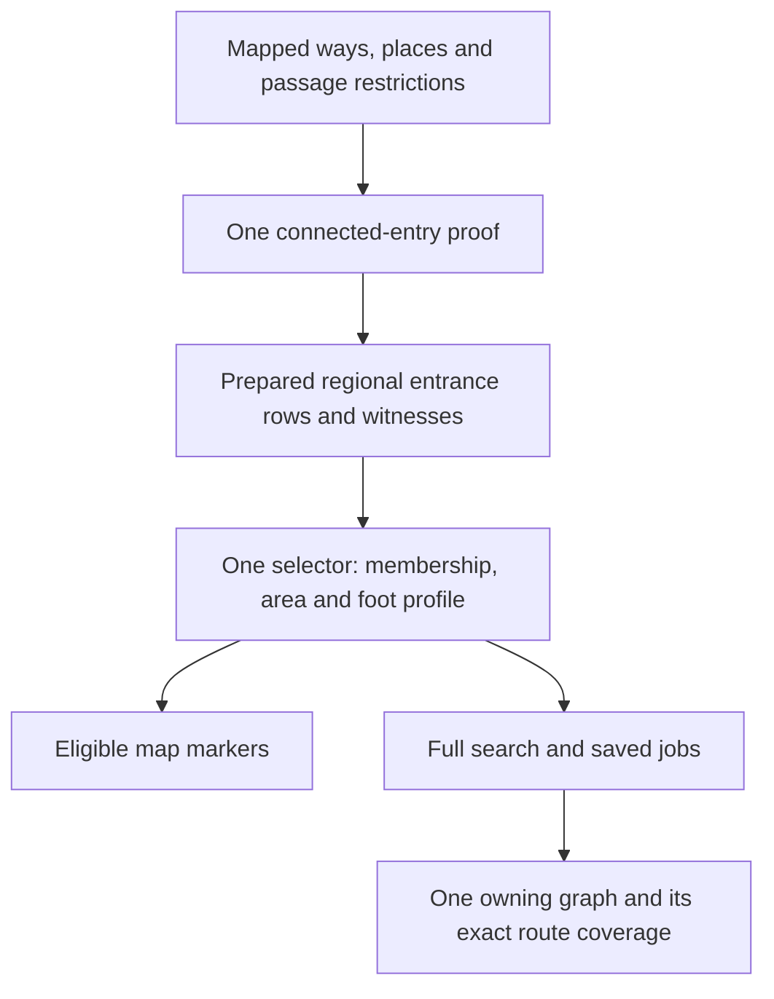

# Access points: one entry model for the whole application

Implementation and review, 2026-09-30. Initial audit baseline: `9fff8d7`;
preimplementation challenge baseline: `8185478`. The decisions below incorporate
the second review; its reports challenge the earlier draft rather than supersede
these decisions.
This covers extraction, preparation, publication, installation, map presentation,
geographic filtering, Full enumeration, and route feasibility across all regions.
The replacement and performance follow-up are implemented. Two full verification
runs pass all 1,388 tests,
lint, types and the application production build; two browser runs pass 11 cases
each. The user-run Central Cascades build and its sealed publication audit pass;
the [preparation performance follow-up](access-review/preparation-performance.md)
removes remaining building work and broad final refreshes. New regional timing
and independently labeled accuracy evaluation remain acceptance work; no measured
regional precision/recall improvement is claimed. Historical audit reports
describe their pinned review snapshots.

## Implemented distinction

**Prepare a connected entrance once; select that recorded entrance everywhere.**
“Prepared membership” means the entrance was admitted into that region's saved
entrance list. Existing `access_points` rows are that list; a display outline is
not membership and there is no second global catalog.



Final source-policy refinements supersede the earlier proposal where it described
unknown-motor tracks as general arrival approaches. Ordinary road contacts root
arrival when foot is usable or a motor direction is public/unknown; both modes
hard restricted excludes them. Connected service approaches retain independent
walking and vehicle passage. Tracks remain walking/hiking geometry, but generic
arrival propagation requires affirmative motor permission in the used direction.
This prevents an unknown-motor track chain from promoting interior hiking
junctions, as original Sunol topology demonstrated.

Mapped parking places and `highway=turning_circle` nodes supply typed local
arrival-place authority at actual physical contacts. A contact requires usable
foot permission or a public/unknown motor direction; both modes hard restricted
excludes it. Actual node foot restrictions remain authoritative. Places cannot
root on a path-only contact. Limited roads supply contacts only for typed places,
never generic roots or invented foot links. Original Top Lake has
a turning-circle track/path contact and a connected trailhead 20.8 m farther
along the public-foot path; preserving those source facts requires no distance
exception, parking invention, road-name rule or special ID. Restricted Discovery
and path-only Alum Rock circles challenge the same rule. This is a source-function
product assumption, not certified global vehicle reachability.

Building density no longer vetoes entrance admission, and production no longer
collects or counts buildings. Historical metadata remains readable. The actual existing
mountain association is **25 walking miles**. The shared helper halves its
50-mile return-distance input; the earlier review mistook that input for the
one-way limit. The independent 25-mile geographic route buffer is unchanged. Association
does not prove a known-only journey to a core or an appealing hike.

The map and Full now use the same request selector, actual regional membership
and requested-profile owner/cycle hints. Unresolved drive filters show no eligible
markers; context trails remain visible. Publication retains policy-versioned
entrance witnesses. Old packs require rebuilding for new starts, while saved
geometry remains readable and unsupported unfinished old jobs stop explicitly.

The initial implementation had a real sparse-stage regression: roughly 46% of
a safe CPU sample was spent repeatedly preparing SQL statements. The correction
caches statements, roots arrival propagation, narrows transition queries and
avoids unused reachability during final frozen refresh. Bounded benchmarks check
identical entrance records. The user's completed regional timings identified
further dead building work and whole-source final refresh work; the linked
performance follow-up records their removal. Updated regional speed is pending
the user's next monitored build.
The disposable diagnosis did not finish a regional pack. A later native-object
diagnostic probe crashed that isolated process; that exit does not establish an
ordinary build failure or memory exhaustion.

See the [implementation validation](access-review/implementation-validation.md)
for committed original-source fixtures, cross-region diagnostic windows, density
controls and bounded timings. Those windows were used to revise the policy and
are **not untouched holdouts**. Candidate counts do not establish precision/recall.
Fresh independently labeled reserved regions remain necessary for that claim.

## Recommendation

Use **one source topology with mode-specific passage rules**, prepare real
entrances from that topology once, and use **one start selector** everywhere.
An entrance is a source-supported place where someone can enter the hiking
network from an arrival/approach location. Its usable movement matters more than
its tag, name, nearby buildings, or position inside an outline.

Keep four questions explicit:

1. Is this a connected pedestrian entrance, and what passage is permitted?
2. What do we actually know about vehicle arrival and parking?
3. Does the entrance belong to the offered/selected hiking region?
4. Can this installed graph support a route under this request?

Those questions can use one prepared record and one selector. They should not
collapse into a confidence score or a single public/unknown/private value whose
meaning changes between preparation, map, and search.

The target is a replacement across preparation, regional selection, the map and
Full search, not a narrow entrance repair. Existing rules must justify themselves
as well as new ones. Implementation order and controlled comparisons are ways to
establish the replacement's behavior, not reasons to shrink its intended scope.

The implementation removes the **fewer than ten buildings within 500 m** veto.
It measures mapped development, a former product preference; it
does not establish entry or hiking quality. A village or visitor facility can
have a useful mountain entrance, while a sparse contact can offer a poor hike.
This is a reasoned product revision, not a measured detector-accuracy improvement.
Test its effect on representative entrances, generated routes and Full-search
cost, rather than retain it merely because it exists or delete it merely because
fewer rules sound better.

Hold historical density and the actual **25-mile mountain association** constant when comparing
old/new detector accuracy, then separately compare product fit with density
removed. That experimental control does not make retention the desired end-state.
Topology plus mountain association does not prove an appealing hike; inspect dense
mountain entrances, sparse urban contacts and routes heading away from the core.
If that reveals a real suitability failure, revise the responsible relevance rule
rather than add an unrelated entrance heuristic. Region-association assumptions
are open to the same scrutiny. Do not silently clip routes or require core visits.

The concrete simplification is smaller than the first draft suggested: regional
artifacts already contain frozen `access_points` rows. Use those rows plus their
`regionId` as the saved region entrance list. Do not create another global catalog.
Replace repeated geometric inference with that authority, and replace nomination
exceptions with one connected-entry calculation over the source topology.

The second review found actual design mistakes worth correcting: motor certainty
must not control the hiking-access toggle; a trailhead tag cannot bypass a missing
or forbidden approach; parking-place evidence is not a routed interior connector;
and a gate's location need not be an entrance's location. Implementation can
proceed from these clarified rules and concrete fixtures. Independent regional
labels are needed to claim improved accuracy, not to begin semantic implementation.

## What the audited baseline did

The detailed independent reviews are [topology and permission](access-review/topology-audit.md),
[geography and map](access-review/geography-audit.md), and
[source semantics and evaluation](access-review/source-audit.md).
The historical second-review challenges are [entry semantics](access-review/entry-preflight.md),
[selection and ownership](access-review/selection-preflight.md), and
[validation](access-review/validation-preflight.md).

| Stage | Current decision | Main weakness |
| --- | --- | --- |
| Extraction | Local highway/access/building context; selected evidence types; reference completion | Some barrier/access nodes and parking relations have no usable semantics; spatial extraction is not a completeness certificate. |
| Normalization | Exclusive trail/street/service/sidewalk class; one pedestrian access state | A foot-allowed road can lose its road identity; vehicle permissions and node crossing restrictions are not represented independently. |
| Nomination | Street contact; evidence at service contact; trailhead within 250 m of track; one parking contact | Different source mapping forms receive different admission rules despite equivalent entry topology. |
| Candidate permission | Worst access state of every incident trail way | A private branch can veto a public departure, while a foot-private gate can be ignored. |
| Product relevance | Fewer than ten mapped buildings within 500 m; actual hiking connection within 25 miles to a GMBA core | These were scope exclusions; the shared helper halves its 50-mile return-distance input. |
| Preparation/publication | Freeze starts, add outside-start neighborhoods and support, prune, measure, compact | Frozen entrance rows already exist; runtime membership inferred from polygons can disagree with those rows. |
| Installed overlap | Stable owner selected by geometry plus graph-node existence | Node existence does not prove that owner admitted the entrance. |
| Named filtering | Expanded start polygon plus another 500 m runtime tolerance | Nearby starts from another installed region can satisfy the selected region without membership. |
| Map | Viewport starts, building check, inclusive cycle check, client unknown toggle | Active drawn/named/driving predicates are not applied to generic dots. |
| Full/jobs | Installed departure, area/access/building checks and inclusive cycle hint; pinned job enumeration | Counts/map can retain starts with no known-only cycle. Solver execution already uses requested-profile hints and traversal; this is not evidence of an unknown-route permission leak. |

These are code-supported mechanisms, not measured frequencies. Some intentional
exclusions are product choices, some are implementation defects, and some are
missing source facts. Counting all three as one error obscures what to change.

## One topology, one entrance proof

Normalize source facts into independent properties: physical way function,
pedestrian passage, motor passage, direction per mode, node crossing restrictions,
and actual mapped trip-start/place observations. A forest track can support both
hiking and driving. `foot=yes` grants foot passage; it does not change a street
into a trail. Ordinary roads remain unable to establish mountain association.

Use a versioned, source-semantic role table, rather than hiding existing name
heuristics inside the word hiking:

| Source function | Role in the entry proof |
| --- | --- |
| Ordinary general-purpose road | Local arrival root when foot is usable or motor passage is public/unknown in at least one direction; both modes hard restricted excludes. Limited-access road nodes are not automatic roadside transfer places. |
| Service/access road or parking aisle | Approach link when connected to an arrival root/place; class alone is not an arrival root. |
| Explicit sidewalk/crossing/access link | Pedestrian approach context, never a hiking seed or generated hike by itself. |
| Path, bridleway, steps, track, non-sidewalk footway/pedestrian way | Hiking/walking role, subject to passage rules; ambiguous walking links still cannot seed mountain association. |
| Track | Walking/hiking geometry remains usable under foot rules. Generic arrival propagation requires affirmative motor permission in the used direction; unknown/private tracks do not promote interior junctions. A track-track junction is not automatically another start. |
| Road with supported walking use | Preserve currently supported walking geometry separately from source road function. Hiking-route relation support is optional future adapter work, not a prerequisite or name-based promotion. |
| Connected explicit trailhead | An assertion of a trip-start location requiring an actual connected, usable mapped approach and departure; the tag cannot grant permission or invent its approach. |
| Parking area | A local place assertion at its actual hiking contact, supported by its mapped arrival contact and foot passage. It supplies no routed interior edge or legal parking guarantee. |
| Turning-circle node | Typed local vehicle-arrival place only at its own usable road/service/track contact. Path-only and hard-restricted contacts cannot root arrival; no parking guarantee. |
| Sign or interior gate | Observation or crossing rule; it is not an automatic trip-start root. |

Represent pedestrian areas as areas/observations until supported walking
connections exist. Never compile their perimeter into a hiking cycle merely
because the source is a closed highway way. Unsupported relations remain a
disclosed representation limitation; do not bundle a new relation engine into
this change. A source role table must preserve supported road-walking geometry
while correcting road identity and mountain seeding.

The finite witness rule is:

1. Begin at a mapped ordinary arrival-road contact or a validated arrival place.
   This establishes a local source assumption, not global vehicle connectivity.
   Never begin at an artificial extraction cut. An explicit trailhead farther
   along a path remains a candidate location requiring approach validation,
   rather than serving as its own proof of arrival.
2. Reach the proposed entry through actual approach-role links under the
   witness's ingress mode, observing direction and node restrictions. Walking
   through hiking-only links cannot spread arrival status into the interior.
   Tracks retain foot geometry even when car permission is unknown or private;
   generic arrival propagation requires affirmative motor permission in the used
   direction. An actual typed arrival place can root its own usable contact.
   An explicitly asserted trailhead may validate its actual walking connection
   from that frontier along hiking links; this validates the asserted location
   without nominating every other visited hiking node.
3. Emit only a source trip-start assertion, an approach-to-hiking role change,
   or an explicitly supported passage/mode frontier. Merely visiting a node or
   a junction of two continuing mixed-use tracks emits nothing. A transition needs
   an arrival-side witness and an actual restriction/role difference, not just
   a generic gate symbol.
4. Require at least one allowed/explicitly unknown hiking departure, including
   the real node crossing and its first segment. Keep the used movement and
   every unresolved passage fact with the decision. At an arrival-road contact,
   do not require walking along an unused road edge merely to enter a public
   trail. A longer car-only ingress is a separate arrival claim; the pedestrian
   evaluator must not pretend it has proved walking on a foot-forbidden road.

Known/inclusive eligibility evaluates **foot passage actually used** by the
chosen entry witness, including its approach where that approach is walked,
crossing and departure. A used unknown foot passage needs inclusive access; an
unused private spur does not veto a public witness. Car uncertainty/private car
access cannot independently veto a proven pedestrian entrance. Neither an unused
vehicle approach nor parking uncertainty makes a known-foot witness unknown.
Keep unsupported car-only arrival claims separate rather than silently broadening
the hiking toggle. No new car-routing service is part of this replacement.

This is one graph reachability/transition calculation per profile, not a walk
from every evidence point with separate gate/trailhead/parking radii. The ordinary
road root is a stated local-access assumption; isolated or stale roads remain
cases to review, not proof of globally verified arrival. An accurately mapped
isolated road can expose a model assumption error; do not automatically blame
the source. Explicit source assertions also need independent review.

The compiler evaluates a usable **ingress/departure pair** or a mapped approach
path at a real source node. Restrictions apply to the movements used by that
witness. All restricted alternatives remain restricted, but an unused private
spur does not invalidate a public entrance. A restrictive passage gate affects
every witness that crosses it. Information-board access describes the board and
does not automatically restrict its neighboring path.

Candidate locations come from actual interfaces between access/approach ways
and hiking ways, together with explicitly mapped trip-start places. Evaluate
all through the same connected-entry proof:

- Use ordinary road contacts, service approaches, parking aisles, and local
  pedestrian access links as source facts. A service approach needs the same
  pedestrian-entry proof as a street approach; it does not need a same-node sign.
- A road/road intersection is not a hiking entry merely because walking is
  permitted on both roads. Hiking function and passage capability are separate.
- A gate is a passage point. It becomes a start when it actually defines a
  supported entry frontier or carries a validated trip-start assertion. An
  interior gate or sign does not create another entrance by itself. For the
  reviewed Stanford/Vargas mapping, a generic gate down an already hiking-only
  path remains a crossing rule; the service/path frontier is the unmarked start.
  This revises the earlier gate-retention repair recommendation deliberately.
  Do not transfer the gate's name or permission to the junction.
- An unmarked road-to-trail transition remains a valid candidate. A separately
  mapped trailhead can remain the actual start when its approach is connected
  and source-supported. Keep its approach and coordinates; do not transplant
  its name or permission onto a nearby junction.
- Retain every independently usable parking exit at an actual hiking contact of
  the validated place. A parking area with separate mapped arrival and hiking
  contacts can assert that local trip-start place without a drawn interior line
  (the Heather-style mapping). Apply its foot restrictions and record the place
  assumption. Its boundary is not a hiking loop; the assertion adds no walking
  connector between contacts and cannot be used by the route solver as one.
- Trace actual topology across source-way splits. Do not use nearest-neighbor
  snapping, entrance clustering, per-evidence distance exceptions, or a road
  name regular expression to establish an entry.

Arrival facts need a precise claim. The smallest useful contract establishes
**local pedestrian entry from a mapped arrival/approach location**. It does not
promise a legal parking space or globally verified passenger-car reachability.
Keep known vehicle restrictions and parking evidence separate. A car-restricted,
foot-permitted approach can be a walk-in entrance; its marker must not imply
that a car can reach the hiking node.

Where local source context proves a motor connection, reuse the same topology
for that fact. Do not flood from an extract edge or largest component to label
all internal roads car-accessible. Artificial boundary cuts are not arrival
roots. A full car-routing stack, extra authority adapters, and per-region road
root lists are unnecessary for the pedestrian-entry contract. If the product
later requires verified car arrival, that is a stronger, separately testable
claim requiring complete approach evidence.

Missing passage tags remain access-unknown, included by default and explicitly
disableable. Missing geometry is a source gap, not access-unknown: there is no
permission setting that can supply a nonexistent connector. Preserve unsupported
conditional restrictions as unresolved conditions; a known restriction must not
disappear into generic unknown. Do not claim date-specific permission without
evaluating its condition. Keep purpose-limited permission distinct from absent
tags; unknown access does not override an established restriction. Interpret
pedestrian direction according to source class and explicit foot tags; ordinary
vehicle oneway must not restrict walking, and prohibiting both foot directions
must produce no foot movement.

Declare the finite source context in which the proof was established. Complete
hiking-route support is not complete arrival context. Retain the witnessed
approach before pruning. A root missing beyond an extraction boundary is a context
limitation, not proof of no physical entrance. Support expansion never discovers
new starts implicitly; changed nomination context requires explicit re-preparation.

## Region membership and boundaries

Keep the GMBA cores as named destination geography. Use each region artifact's
frozen entrance records as **explicit membership**, rather than adding a second
catalog. Keep the current inclusive, undirected hiking/possible-link association:
at most 25 walking miles to an unambiguous hiking link touching the core, measured with
the current endpoint seeding. Ordinary roads cannot establish it. This is static
destination association, not proof of a known-only directed journey to the core.
Keep the effective 25-mile association limit independent of the route-support
budget without changing its value or pretending it measures the exact core intersection.

Named selection is membership in the prepared entrance set, including actual
approaches outside the core. Drawn selection is exact entrance-coordinate
containment. Driving selection is the requested outer contour minus its inner
contour, optionally intersected with named membership. Drawing continues to
override the other choices. Contours select starts; they do not prove individual
car access or clip hiking geometry.

This removes both named-region proximity inference and registration circles as
admission mechanisms. Circles can remain compatibility/display geometry while
membership migrates, then be replaced with clear core outlines and real entrance
markers. Neither a park border nor a hiking line crossing a download boundary
creates an entrance. Broadening a region cannot repair missing source topology.

Choose an overlapping graph owner only among artifacts that actually admitted
the entrance under the installation's policy **in the requested foot-witness
profile**. An inclusive-only record in A cannot suppress a known record in B.
Order those candidates by stable region ID and graph identity, then pin the owner
before checking cycle/route feasibility.
Selected region IDs filter membership but do not reorder owners. Never choose an
owner according to whether a solver happens to find a route. Apply regional
membership independently of owner choice. Retain deterministic one-graph ownership for the whole solve;
never join overlapping graphs or combine their topology hints to invent a route.
Equivalent source/policy inputs need a support audit; a deterministic owner does
not promise the best route available in the union of differing graph supports.

## Preparation, runtime, and map share one meaning

The module's external interface needs two operations: prepare entrance decisions
from pinned topology/policy, and select starts from those decisions plus a pinned
request. Its implementation owns movement proofs, provenance, region membership,
profile hints, ownership, and decision reasons. Callers should not reconstruct
those facts from coordinates, names, or confidence levels.

Conceptually:

```text
pinned source topology + passage policy
                  |
        prepared entrance decisions
          /                   \
 region memberships      one owning graph + route support
          \                   /
         shared request start selector
              /              \
   eligible map layer      Full enumeration -> saved job
```

Preserve early freezing, complete per-start support before elevation, immutable
artifacts, and metric reuse. Evaluate fixed product relevance once during
preparation. Runtime selects against the recorded policy and request, rather than
reapplying a potentially different current density threshold to an old pack.
Changing policy invalidates affected preparation receipts; unchanged physical
measurements remain reusable. Older artifacts and saved results retain their
recorded meanings through an explicit migration.

Node/movement restrictions also survive graph publication, corridor compaction,
known/inclusive topology hints, map edge exposure, and final solver validation.
Admission-only enforcement would still allow a route through a restrictive
interior gate. Preserve crossing nodes or an equivalent exact movement encoding;
do not turn one blocked branch movement into a blanket veto on its junction.
A barrier mapped ambiguously on a multiway junction cannot be assigned a favored
unrestricted crossing through geometric guesswork. Starting at a barrier cannot
bypass its restriction.

Migration rule: ship one new selection policy. Every contributing artifact must
declare compatibility; an unrelated old installed region must not disable a
compatible selected region. Do not mix old geometric admission with record-based
membership in one new job. Incompatible eligible markers and new searches are
unavailable until those areas are rebuilt; preserve their data and saved results.
New jobs pin policy, installation and owner meaning. Existing jobs do not currently
pin enough to guarantee exact resumption after changing this algorithm. Stop
unsupported unfinished jobs with a clear reason and preserve partial results,
rather than retaining a permanent second selector or re-enumerating silently.
Already recorded geometry/results stay readable. Policy-version migration and
legacy unfinished-job stopping are now covered by integration fixtures.

Use one selector for eligible map highlighting, counts, Full enumeration, and
explicit-start validation. The viewport only limits rendering/data fetching;
panning cannot change the eligible set. Contextual entrances outside the active
filter may be shown with different styling and clear meaning. While driving
geometry is unresolved or failed, do not display a broadened eligible set.

Cycle feasibility uses the owning graph's requested known/inclusive profile.
A public entrance whose only loop crosses unknown links is not a known-only viable start. Keep
legacy missing hints conservative. A feasibility hint is a safe exclusion bound,
not proof of a simple loop/lollipop satisfying requested distance, elevation,
grade, direction and repetition; the solver owns that proof. No-route outcomes
and computation limits remain visible. Return exact and close matches separately.
Keep only proved safe exclusions in this selector. In particular, an exact-route
distance bound must not discard a start that can produce a longer labeled close
match; cover that case before moving solver feasibility checks into selection.

Show destination/core geography, the active start filter, actual entrance markers,
and downloaded routing support with distinct labels. Start coverage and the
hard route boundary are different geometries. Every route remains inside its
own graph and exact installed routing coverage, even when it leaves a drawn,
named or driving area. Alternate-entrance grouping remains presentation only;
it never drops starts or changes their coordinates, movement or criteria.

Jobs pin entrance decisions, installation, profile, criteria and resolved area.
Opening saved work uses that snapshot. Form edits and current map state do not
redefine an existing job's eligible count or results. Full continues to attempt
every selected start and retain up to ten exact routes, or one labeled close
match where no exact route was found.

## Why this method is simpler

The current design repeatedly infers entry from a feature type and membership
from geometry. The replacement prepares the entry fact once and selects it.
OSM's mode/barrier semantics remain real implementation complexity, but they
concentrate in one module used by all callers.

| Alternative | Reason to reject as the general method |
| --- | --- |
| Curated/agency trailhead catalog | Misses unmarked entrances, depends on regional availability/licensing, and still needs topology validation. Useful independent review evidence. |
| More gate/parking/region exceptions | Makes eligibility depend on evidence kind or region and hides which actual movement was established. |
| Distance snapping or spatial entrance clustering | Can cross fences, rivers, parallel roads and disconnected trails; can remove valid starts. |
| More terrain/population/land-owner layers | Adds sources without establishing pedestrian entry or permission. Core geography already serves destination scope. |
| A learned validity score | Adds labels, tuning and regional drift; a score cannot create missing topology or resolve known restrictions. |
| A pure car-network frontier | Useful for verified motor arrivals, but loses mixed-use track starts and walk-in entrances unless place and movement semantics are retained; local clips cannot establish global car reachability. |

No optimality or accuracy theorem is claimed. The design removes repeated
inference and evidence-specific admission paths; whether its source assumptions
improve regional accuracy needs independent comparative measurement.

## Acceptance across regions

For the accuracy comparison, label complete small study windows independently
of generated candidates in both Washington and California. Record physical entry, foot permission,
arrival/parking facts, and regional relevance separately, with exact movement,
evidence date and unresolved facts. Include every emitted candidate and all
independently identified entrances in each window, so recall has a denominator.
Famous/reviewed trailheads alone are insufficient. Reserve whole-region holdouts
and freeze the policy before evaluating them.

Mandatory cases span the whole lifecycle: unmarked road entries, mixed-use tracks,
service approaches, pedestrian-private barriers, car-private/foot-public gates,
unrelated private spurs, interior signs, multiple parking exits, disconnected
parking, crossings without shared nodes, pedestrian plazas, dense legitimate
entrances, sparse urban/farm contacts, GMBA foothills, unsupported relations and
conditions, boundary starts/holes, neighboring-region starts, overlapping owners,
unknown-only cycles, and saved-job restoration after policy/data changes.

Run baseline and proposal on identical pinned inputs. Report physical-entry
precision/recall, restricted inclusions, membership errors, arrival-claim errors,
product exclusions, duplicate outputs, unresolved truth, and source gaps
separately, for both access profiles and each region. Define real entry movements,
trip-start places and permitted location aliases before one-to-one matching.
Distinct usable node starts along one approach are not automatically invalid
duplicates; report redundant representations separately. Proximity to a famous
point is not identity. Do not optimize total
start count or a pooled score that hides a region's regression.

Require fewer resolved false positives and false negatives across holdouts, or
an explicitly documented tradeoff. Semantic metamorphic tests must also show
that splitting a source way, renaming a road, changing evidence placement while
preserving its actual approach, expanding routing support with identical entry
context, or panning the map does not
arbitrarily change entry validity/membership. Adding an equivalent overlapping
artifact must not suppress a real entrance merely because it contains its node.
New installations can legitimately change owner/route feasibility when support,
source or policy changes; existing jobs retain their pinned installation/owner.
Moving a gate or changing its access genuinely can change the movement and must
not be asserted invariant. Keep automated inputs committed and network-free.

Implementation has two focused behavior waves:

1. Implement the source-role/foot-entry evaluator in the real compiler, with
   committed raw-source fixtures exercising its public seam. Replace nomination
   and passage semantics together, carrying barriers and directions through
   publication, compaction, hints and final routes. Hold relevance policy constant
   for the detector comparison and evaluate the proposed density removal separately.
   This is one production implementation, not a parallel reference engine or
   an old-rule fallback. Explain changed fixture expectations explicitly.
2. Consume the existing regional entrance rows for membership and profile-aware
   deterministic ownership. Use one selector for map/counts/Full/explicit starts;
   migrate jobs/artifact compatibility and remove proximity admission. Keep
   route support separate from start filtering and preserve saved results.

Each wave deletes its superseded rules and runs the runbook's full verification.
Audit rebuilt real data when the prepared contract changes. Evaluate accuracy
against independently labeled windows/holdouts before calling the replacement
more accurate; synthetic cases establish semantics rather than regional recall.
Stop promotion for newly admitted known-forbidden passage, an invented connector,
or an unexplained loss of a resolved in-policy entrance. Do not add another data
source or subsystem merely to hide such a failure. The final full regional build
is reserved for the user to run and monitor.

Review evidence: the independent audits reran current offline suites totaling
79 topology/normalization/filter cases and 62 geography/reader/search cases
(including overlapping coverage of the eligibility suite). These establish
baseline behavior, not improved accuracy. The source review verified primary
documentation and maintained implementations. Documentation diff/link checks
complete this review; a labeled cross-region comparison remains future work.
The second review reran 101/101 entry/source/compaction baseline cases and 63/63
selection/reader/solver/job cases (with overlapping coverage between reviews),
and reproduced two direction interpretation defects with direct offline probes.
Those historical baseline suites did not test the replacement. Current
implementation evidence is recorded separately in the validation report and
status; existing published packs and installations remain preserved.

## Primary sources and assumptions

- [OSM access hierarchy](https://wiki.openstreetmap.org/wiki/Key:access): passage
  permissions differ by mode and purpose. Their presence does not certify source
  completeness or current legal conditions.
- [OSM barrier mapping](https://wiki.openstreetmap.org/wiki/Key:barrier#How_to_map_barrier_nodes)
  and [gate semantics](https://wiki.openstreetmap.org/wiki/Tag:barrier=gate): a
  passage restriction belongs to its actual crossing; gates commonly sit beside
  a road/path junction. Gate existence is not permission.
- [OSM trailhead](https://wiki.openstreetmap.org/wiki/Tag:highway=trailhead),
  [track](https://wiki.openstreetmap.org/wiki/Tag:highway=track), and
  [parking](https://wiki.openstreetmap.org/wiki/Tag:amenity=parking): trip-start
  places, mixed-use land-access roads and parking facilities describe different
  source facts; none supplies an arbitrary missing walking connector.
- [OSM turning circles](https://wiki.openstreetmap.org/wiki/Tag:highway=turning_circle):
  a mapped vehicle turning place is a local source-function fact; parking and
  globally verified public arrival do not follow from its tag.
- [OSM pedestrian direction](https://wiki.openstreetmap.org/wiki/Key:oneway:foot):
  generic oneway interpretation varies by way function; explicit foot direction
  is unambiguous. Preserve unresolved source ambiguity.
- [GraphHopper foot access](https://github.com/graphhopper/graphhopper/blob/master/core/src/main/java/com/graphhopper/routing/util/parsers/FootAccessParser.java),
  [barrier access](https://github.com/graphhopper/graphhopper/blob/master/core/src/main/java/com/graphhopper/routing/util/parsers/AbstractAccessParser.java),
  and [OSRM foot profile](https://github.com/Project-OSRM/osrm-backend/blob/master/profiles/foot.lua)
  demonstrate established mode/node semantics. Reuse those principles, not their
  generic-walking defaults or a second routing system.
