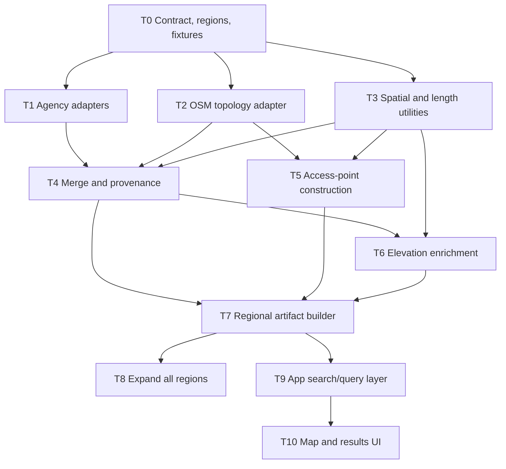

# Alpine Search hiking-data implementation plan

Status: T0–T7 fixture pipeline implemented; Gate C real-data validation open
Primary integration branch: `codex/trails-data`
First production slice: Yosemite–Stanislaus
Current evidence: [coverage-spike.md](./coverage-spike.md)

Immediate next task: T7.1 Gate C real-data corridor pilot. Do not begin T8 or
T9 until T7.1 and T7.2 are accepted.

## Objective

Build a deterministic, hiking-only data pipeline that produces:

1. A searchable catalog of named hiking trails.
2. Credible trailheads and public access points for drive-time filtering.
3. A routable segment-and-node graph that can later generate custom routes by
   requested distance, elevation gain, grade, and route shape.
4. Consistent length and elevation properties derived by Alpine Search rather
   than mixed calculations from upstream providers.

The first slice must prove the complete pipeline in Yosemite–Stanislaus before
expanding to the Bay Area, Sierra National Forest, and Tahoe–Eldorado.

## Product rules

- Hiking is the only supported activity in this phase.
- Explicitly private, closed, planned, construction, or foot-prohibited ways
  are excluded.
- Missing permission is `unknown`, never silently converted to `allowed`.
- A line intersecting a drive-time polygon is not a reachable result unless a
  credible access point for that trail is inside the polygon.
- Every normalized field retains source provenance.
- Detailed routing geometry and simplified display geometry are separate.
- Normal development and tests do not contact remote services.
- Network refreshes are explicit and source-specific.

## Architecture decision

Do not use D1 for the initial immutable trail corpus. Generate versioned static
regional artifacts and serve them with the existing Sites application. D1
continues to handle reachability jobs and API-usage accounting.

Use a one-time local source snapshot, then iterate offline:

- ArcGIS/agency GeoJSON snapshots for USGS, USFS, NPS, State Parks, and EBRPD.
- A California OSM PBF extract for topology, tags, and access-point candidates.
- A common USGS 3DEP elevation product for elevation enrichment.

If final geometry becomes too large for static assets, move geometry blobs to
R2 in a later, separately reviewed change. Do not add R2 speculatively.

## Target repository layout

```text
scripts/trails/
  model.mjs
  regions.mjs
  build-region.mjs
  sources/
    arcgis.mjs
    usgs.mjs
    usfs.mjs
    nps.mjs
    state-parks.mjs
    ebrpd.mjs
    osm.mjs
  normalize/
    segments.mjs
    provenance.mjs
    merge.mjs
  spatial/
    geometry.mjs
    length.mjs
    snap.mjs
  graph/
    topology.mjs
    access-points.mjs
  elevation/
    profile.mjs
    metrics.mjs
  qa/
    report.mjs

data/trails/
  coverage-spike.json
  generated/
    yosemite-stanislaus/
      manifest.json
      named-trails.json
      access-points.geojson
      segments.ndjson
      nodes.ndjson
      qa.json

tests/fixtures/trails/
tests/trails-*.test.mjs
```

Large raw downloads belong in an ignored local cache such as
`.cache/trails/`; they must not be committed. Small, hand-reviewed fixtures and
generated regional artifacts may be committed.

## Canonical contract

Wave 0 must freeze these shapes before parallel implementation begins.

### `SourceRef`

```ts
{
  provider: string;
  sourceId: string;
  sourceUpdatedAt?: string;
  retrievedAt: string;
  sourceUrl: string;
}
```

### `TrailSegment`

```ts
{
  id: string;
  fromNodeId: string;
  toNodeId: string;
  geometry: GeoJSON.LineString;
  displayGeometry?: GeoJSON.LineString;
  name?: string;
  manager?: string;
  hiking: "allowed" | "blocked" | "unknown";
  access: "public" | "private" | "unknown";
  status: "open" | "closed" | "seasonal" | "unknown";
  surface?: string;
  lengthMeters: number;
  ascentForwardMeters?: number;
  descentForwardMeters?: number;
  minElevationMeters?: number;
  maxElevationMeters?: number;
  maxGradePct?: number;
  sourceRefs: SourceRef[];
}
```

Reverse traversal swaps forward ascent and descent. Do not duplicate geometry
solely to represent direction.

### `TrailNode`

```ts
{
  id: string;
  longitude: number;
  latitude: number;
  sourceNodeIds: string[];
  incidentSegmentIds: string[];
}
```

### `AccessPoint`

```ts
{
  id: string;
  longitude: number;
  latitude: number;
  name?: string;
  type: "trailhead" | "entrance" | "parking" | "derived";
  confidence: "official" | "mapped" | "derived";
  connectedNodeIds: string[];
  sourceRefs: SourceRef[];
}
```

### `NamedTrail`

```ts
{
  id: string;
  name: string;
  segmentIds: string[];
  accessPointIds: string[];
  manager?: string;
  bounds: [number, number, number, number];
  lengthMeters?: number;
  sourceRefs: SourceRef[];
  dataConfidence: "high" | "medium" | "low";
}
```

`NamedTrail.lengthMeters` is omitted when the named corridor is branching or
does not describe one traversable route. Segment lengths remain authoritative.

## Source precedence

| Property | Preferred authority | Fallback |
|---|---|---|
| Geometry baseline | USGS or land manager | OSM |
| Hiking permission | USFS/NPS/local manager | OSM explicit tag |
| Status/closure | Land manager | unknown |
| Surface/class | Land manager | OSM |
| Names | Land manager/USGS | OSM |
| Topology | OSM node identity | snapped official endpoints |
| Trailheads | Official access points | OSM, then derived |
| Length | Alpine Search geometry calculation | none |
| Elevation | Alpine Search 3DEP calculation | none |

Conflicts are preserved in provenance and surfaced in QA; precedence must not
erase the losing source record.

## Dependency graph



## Execution waves

### Wave 0 — contract freeze

#### T0: Canonical contract, regions, and fixtures

Owner: integration agent
Branch: `codex/trails-contract`
Dependencies: none

Owned files:

- `scripts/trails/model.mjs`
- `scripts/trails/regions.mjs`
- `tests/fixtures/trails/**`
- `tests/trails-model.test.mjs`

Deliverables:

- Runtime validators for every canonical record.
- Stable ID rules based on provider/source identity and normalized geometry.
- Modular definitions for `yosemite-stanislaus`, `bay-midpen`, `bay-east`,
  `sierra-national-forest`, and `tahoe-eldorado`.
- Minimal fixtures representing named, unnamed, restricted, disconnected, and
  conflicting-source cases.

Acceptance:

- Malformed coordinates and invalid enum values are rejected.
- IDs are deterministic across repeated runs.
- Fixtures contain no network dependency.
- Targeted model tests pass.

Do not start Wave 1 until T0 is merged into every worker branch.

### Wave 1 — three parallel workers

#### T1: Official agency source adapters

Branch: `codex/trails-agency-adapters`
Dependencies: T0

Owned files:

- `scripts/trails/sources/arcgis.mjs`
- `scripts/trails/sources/usgs.mjs`
- `scripts/trails/sources/usfs.mjs`
- `scripts/trails/sources/nps.mjs`
- `scripts/trails/sources/state-parks.mjs`
- `scripts/trails/sources/ebrpd.mjs`
- `tests/trails-agency-sources.test.mjs`
- Agency-specific fixtures only

Deliverables:

- Pagination-safe, cached ArcGIS snapshot readers.
- Pure normalization from cached source features to provisional segments.
- Source-specific field mapping for names, hiking, access, status, surface,
  manager, source length, and provenance.
- No silent treatment of missing access as public.

Acceptance:

- Tests use fixtures only.
- Empty layers are valid results, not errors.
- Flaky API behavior cannot affect offline normalization.
- USFS and NPS hiking fields match the coverage-spike interpretations.

#### T2: OSM snapshot and topology adapter

Branch: `codex/trails-osm-topology`
Dependencies: T0

Owned files:

- `scripts/trails/sources/osm.mjs`
- `scripts/trails/graph/topology.mjs`
- `tests/trails-osm-topology.test.mjs`
- OSM-specific fixtures only

Deliverables:

- Read a cached California PBF or a small fixture extract without Overpass.
- Preserve OSM node IDs and ordered way-node membership.
- Include hiking-relevant `path`, `footway`, `steps`, and `bridleway` ways,
  with explicit filters for private/no-foot/construction/proposed features.
- Normalize surface, `sac_scale`, visibility, access, and hiking-route relation
  membership.
- Emit provisional graph nodes and segments.

Acceptance:

- Repeated builds produce identical IDs and ordering.
- Shared OSM nodes remain shared graph nodes.
- Explicitly restricted ways are excluded or marked blocked according to the
  contract.
- No OSM account or live Overpass request is required.

#### T3: Spatial, snapping, and length utilities

Branch: `codex/trails-spatial`
Dependencies: T0

Owned files:

- `scripts/trails/spatial/geometry.mjs`
- `scripts/trails/spatial/length.mjs`
- `scripts/trails/spatial/snap.mjs`
- `tests/trails-spatial.test.mjs`

Deliverables:

- Geodesic line length.
- Bounds, coordinate validation, and geometry orientation helpers.
- Endpoint snapping with explicit meter tolerance and deterministic tie-breaks.
- Geometry simplification for display that never mutates routing geometry.

Acceptance:

- Length tests include known California coordinate pairs.
- Snapping never joins endpoints beyond the configured tolerance.
- Ambiguous snap candidates are reported rather than arbitrarily joined.
- Detailed geometry remains byte-for-byte unchanged after display
  simplification.

### Wave 2 — merge, access, and elevation

Run T4 and T5 in parallel after Wave 1. Start T6 when T4 has a stable normalized
segment fixture.

#### T4: Merge, deduplication, and provenance

Branch: `codex/trails-merge`
Dependencies: T1, T2, T3

Owned files:

- `scripts/trails/normalize/segments.mjs`
- `scripts/trails/normalize/provenance.mjs`
- `scripts/trails/normalize/merge.mjs`
- `tests/trails-merge.test.mjs`

Acceptance:

- Merge uses geometry proximity plus normalized name/manager evidence; name
  equality alone is insufficient.
- Official access/status wins while conflicting source values remain in
  provenance and QA.
- Unnamed segments remain graph-usable.
- Duplicate inputs do not duplicate output records.

#### T5: Trailhead and access-point construction

Branch: `codex/trails-access-points`
Dependencies: T2, T3

Owned files:

- `scripts/trails/graph/access-points.mjs`
- `tests/trails-access-points.test.mjs`

Candidate priority:

1. Official trailhead/entry point.
2. OSM `highway=trailhead` or `information=trailhead`.
3. Public parking/entrance within a strict walking-distance threshold.
4. Derived public-road/network endpoint with low confidence.

Acceptance:

- No candidate on explicitly private land is emitted.
- Every access point connects to at least one graph node.
- Derived points are labeled `derived` and never promoted to official.
- Duplicate nearby official/OSM points merge without losing provenance.

#### T6: 3DEP elevation enrichment

Branch: `codex/trails-elevation`
Dependencies: T3 and stable T4 fixture

Owned files:

- `scripts/trails/elevation/profile.mjs`
- `scripts/trails/elevation/metrics.mjs`
- `tests/trails-elevation.test.mjs`
- Small elevation fixtures only

Deliverables:

- Sample a cached 3DEP raster/profile source at documented spacing.
- Apply documented noise smoothing before summing gain/loss.
- Calculate forward ascent/descent, min/max elevation, and maximum grade.
- Record elevation source/version and sampling settings in the manifest.

Acceptance:

- Reversing a segment swaps ascent and descent within rounding tolerance.
- Flat synthetic profiles do not accumulate artificial gain.
- Missing raster coverage produces missing metrics, not zero.
- Tests do not call the USGS point API.

### Wave 3 — artifacts and product integration

#### T7: Yosemite–Stanislaus artifact builder and QA

Owner: integration agent
Branch: `codex/trails-data`
Dependencies: T4, T5, T6

Owned files:

- `scripts/trails/build-region.mjs`
- `scripts/trails/qa/report.mjs`
- `data/trails/generated/yosemite-stanislaus/**`
- `tests/trails-build-region.test.mjs`
- Root `package.json` and README changes

Required QA metrics:

- Input/output counts by source.
- Named and unnamed segment counts.
- Allowed/blocked/unknown hiking and access counts.
- Connected components and isolated segments.
- Official/mapped/derived access-point counts.
- Merge conflicts and ambiguous snaps.
- Elevation coverage and implausible metric outliers.
- Deterministic artifact hashes.

Gate: review the Yosemite–Stanislaus QA report before any app integration.

Completion note (2026-08-03): the T7 builder, artifact contract, fixture tests,
and QA report are implemented. The current generated seed contains only two
fixture-backed segments and has zero elevation coverage. It validates the
pipeline mechanics but does not pass Gate C as a production regional corpus.

#### T7.1: Gate C real-data corridor pilot and pipeline hardening

Owner: integration hardening agent
Branch: `codex/trails-gate-c-pilot`
Dependencies: implemented T6 and T7 fixture pipeline

Goal: prove the complete pipeline on a deliberately small, real
Yosemite–Stanislaus corridor before downloading or processing the entire
region. Use one or two connected named trail corridors with real agency, OSM,
access-point, and 3DEP evidence. Keep all downloaded inputs under the ignored
`.cache/trails/` tree.

Owned files:

- `scripts/trails/build-region.mjs`
- `scripts/trails/sources/osm.mjs`
- `scripts/trails/normalize/merge.mjs`
- `scripts/trails/graph/access-points.mjs`
- `scripts/trails/qa/report.mjs`
- `scripts/trails/elevation/**` only if real cached 3DEP ingestion requires it
- A new explicit regional refresh/preparation script if needed
- New or updated `tests/trails-*.test.mjs` and small fixtures
- README documentation for the reproducible cached-input workflow

Required hardening:

1. Enforce the configured region bounds during ingestion/building. Out-of-region
   records must be clipped, omitted, or reported according to one documented
   rule; a California PBF must not silently produce a statewide Yosemite
   artifact.
2. Extract or prepare real access candidates for the build: official
   trailheads where available, OSM trailheads/entrances, explicitly public
   parking, and public-road evidence for derived access points. Do not require
   hand-authored candidates for the pilot.
3. Reconcile agency geometry with OSM graph granularity. Split and/or snap
   official geometry onto selected OSM topology so a long A–B–C agency line and
   OSM A–B/B–C edges do not remain three overlapping routes. Segment geometry
   endpoints must agree with their canonical node coordinates.
4. Preserve field-level merge provenance in a shipped sidecar or an equally
   reviewable artifact; combined record-level `sourceRefs` alone are not enough.
5. Document an explicit source refresh/preparation command. After that command,
   normal builds and tests must be offline.
6. Build the same cached pilot twice and verify byte-identical artifacts and
   stable hashes.

Acceptance:

- A test proves out-of-region geometry cannot enter a regional artifact
  unnoticed.
- An integration test proves tagged OSM/official access evidence reaches
  `buildAccessPoints` and every searchable pilot trail has a credible access
  point.
- An integration test covers mismatched agency/OSM segmentation and verifies
  graph nodes agree with geometry endpoints.
- The real pilot includes non-zero agency and OSM counts, at least one
  searchable named trail, at least one credible access point, and non-zero
  3DEP elevation coverage.
- No unexplained merge conflicts, ambiguous snaps, missing topology, or
  implausible elevation outliers remain.
- Targeted tests, full `npm test`, and lint pass.
- Deliver one focused commit plus the exact refresh, build, and test commands.

Scope limits:

- Do not modify the application search API or UI.
- Do not commit raw PBF, ArcGIS snapshots, DEM files, credentials, or other
  large cache inputs.
- Do not use Overpass or require an OSM account. Prefer public downloads and
  existing public agency endpoints; report any source that truly requires an
  account instead of adding credentials speculatively.
- Do not publish the small corridor pilot as the final regional artifact.

#### T7.2: Full Yosemite–Stanislaus production build and Gate C review

Owner: integration agent
Branch: `codex/trails-data`
Dependencies: accepted T7.1

Run the hardened pipeline against the complete cached Yosemite–Stanislaus
inputs, generate `data/trails/generated/yosemite-stanislaus/**` twice, and
manually review the final QA report. Record expected source counts, explain
material exclusions/conflicts, confirm credible access for every searchable
trail, review isolated components, confirm useful elevation coverage, and
verify static artifact sizes. Gate C passes only after this review is accepted.

#### T8: Regional expansion

Branch: `codex/trails-region-expansion`
Dependencies: accepted T7.2 and Gate C

Add Bay Area, Sierra National Forest, and Tahoe–Eldorado through region config
and source snapshots only. Do not fork the normalization logic by region.

#### T9: App search/query layer

Branch: `codex/trails-search-api`
Dependencies: accepted T7.2 artifact contract and Gate C

Responsibilities:

- Load compact regional manifests/indexes.
- Filter by access point inside the active drive-time polygon.
- Filter hiking status conservatively.
- Return metadata first and geometry lazily.
- Keep external source calls out of request handling.

#### T10: Map and result UI

Branch: `codex/trails-ui`
Dependencies: stable T9 response contract

Responsibilities:

- Hiking-trails layer toggle.
- Reachable result count and list.
- Trailhead markers and selected trail geometry.
- Name, manager, length, gain/loss, elevation range, surface, access confidence,
  and source/update details.
- Clear unknown and closure messaging.

Do not let the UI agent invent data fields or read raw source artifacts.

## Agent coordination rules

1. Use separate worktrees or branches. Multiple agents must not edit the same
   working tree concurrently.
2. The integration agent owns shared files: `package.json`, `README.md`, this
   plan, generated production artifacts, and final build configuration.
3. Worker agents edit only their owned paths. If another file is required,
   report the requested change to the integrator instead of editing it.
4. Agents do not update this plan file; they report status and commit hashes to
   the integrator.
5. Each worker delivers one focused commit with a short schema/API note and the
   exact targeted test command used.
6. No worker performs a full network refresh unless explicitly assigned.
7. No live network calls are allowed in automated tests.
8. The integrator merges Wave 1 in this order: T3, T1, T2. Then it resolves the
   shared contract once before starting Wave 2.
9. Generated artifacts are produced only by the integrator after code merges;
   workers must not commit competing generated outputs.
10. Run `npm test` only at integration gates. Workers run their targeted Node
    tests to keep iteration fast.

## Copyable agent prompts

### Agency adapter agent

> Read `docs/trails/implementation-plan.md`. Implement T1 only on branch
> `codex/trails-agency-adapters`. Respect the frozen canonical contract and edit
> only the T1-owned paths. Work exclusively from cached fixtures in tests; do
> not query live services during tests. Deliver one commit, the targeted test
> command, and any contract mismatches for the integrator.

### OSM topology agent

> Read `docs/trails/implementation-plan.md`. Implement T2 only on branch
> `codex/trails-osm-topology`. Preserve stable OSM node identity and ordered way
> membership. Use a cached PBF/fixture path, not Overpass or an OSM account.
> Edit only T2-owned paths. Deliver one commit, targeted test results, and any
> proposed filtering changes.

### Spatial utilities agent

> Read `docs/trails/implementation-plan.md`. Implement T3 only on branch
> `codex/trails-spatial`. Provide deterministic geodesic length, validation,
> endpoint snapping, and non-destructive display simplification. Edit only
> T3-owned paths. Deliver one commit and targeted test results.

### Integration agent

> Read `docs/trails/implementation-plan.md` and act as the integrator. Complete
> T0 first, freeze the contract, then dispatch T1–T3. Do not start app UI work
> before T7 passes its QA gate. Preserve the existing reachability behavior and
> keep normal trail-data iteration offline and fast.

### Gate C pilot agent

> Read `docs/trails/implementation-plan.md` completely and execute T7.1 only.
> Do not start T7.2, T8, T9, or application UI work. Use an isolated worktree on
> branch `codex/trails-gate-c-pilot` based on a checkpoint that contains the
> implemented T0–T7 pipeline. First inspect the current Git state and preserve
> all unrelated user changes; never reset or delete them. Prove the pipeline on
> one small real Yosemite–Stanislaus trail corridor, then harden regional
> filtering, access-candidate ingestion, agency/OSM topology reconciliation,
> and shipped field provenance as specified in T7.1. Network access is allowed
> only for an explicit source refresh/preparation step; cache the results and
> keep automated tests offline. Do not commit large cached source files. Build
> the pilot twice, run targeted tests plus full test and lint gates, and deliver
> one focused commit, the exact commands used, QA findings, and any blocker that
> must be resolved before T7.2.

## Integration gates

### Gate A — contract

- T0 merged.
- Worker fixtures validate against the same contract.
- No package or runtime dependency chosen without integrator review.

### Gate B — normalized graph

- T1–T5 merged.
- Yosemite–Stanislaus graph is deterministic.
- Restricted ways are excluded/blocked correctly.
- Access points connect to graph nodes.
- Merge conflicts and ambiguous snaps are reported.

### Gate C — enriched artifacts

- T6–T7 merged.
- Length and elevation tests pass.
- Artifact sizes are acceptable for static Sites delivery.
- T7.1 real-data corridor pilot passes its integration acceptance criteria.
- T7.2 full regional artifacts are reproducible from cached inputs.
- Full regional QA report reviewed manually and accepted.

### Gate D — product

- T9–T10 merged.
- Existing reachability tests still pass.
- Reachable trails are selected by access point, not line intersection.
- Full `npm test` passes.
- Browser QA is performed only when explicitly requested.

## Definition of done for the data phase

- Yosemite–Stanislaus artifacts are reproducible from cached inputs.
- Every shipped segment has valid detailed geometry, deterministic identity,
  calculated length, and provenance.
- Elevation metrics are present or explicitly unavailable.
- Every searchable named trail has at least one credible access point.
- The graph preserves sufficient topology for future constraint-based route
  generation.
- Default development commands do not depend on public API availability.
- Source refreshes remain explicit, modular, and independently runnable.
